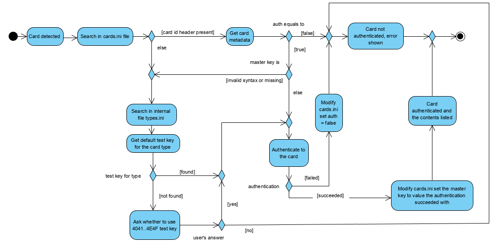

# JCAppStore 

Have you ever wondered how to manage your passwords? Or would you like to have your own virtual wallet, but do not know what to do? Then it is time for you to discover JCAppStore, first open source smart card store and GUI tool.

#### I am in! ####

There are several things you need to have and know first. Don't worry, we tried to make it as 
intuitive as possible.

1. :credit_card: Own a card - naturally, you need to have a card. If don't check this 
[awesome buyer's guide](https://github.com/martinpaljak/GlobalPlatformPro/tree/master/docs/JavaCardBuyersGuide). 
2. :key: Make sure you know the master password. This should've been given to you 
by card vendor. Though for most common card types, the store recognizes the default passwords 
automatically :thumbsup:.
3. :abcd: Get yourself familiar with basic terms. You've learned words like software, touch 
screen, charger and so on. Smart cards have their own terms too.

How to get the store
-----

**The store runs on java, make sure you have Java Runtime Environment (JRE) first.** Any version 8+ 
(also called 1.8+) should be convenient. [The store was developed using java 8](https://www.oracle.com/technetwork/java/javase/downloads/jre8-downloads-2133155.html)

#### Windows
In Releases, download the latest windows zip file. Extract contents of the zip and open it. Inside, double click 
JCAppStore-[version]-win.jar file - it is an installer that will install the store for you: follow the instructions.

#### Unix/Linux
For ubuntu/debian, a `.deb` package is available. Just install the package and run the application twice: for the first time using `root`:
```
$ sudo jcapp
```
The store has to change access rights for the JCAppStore sources folder. We are unable to do it when installing as we can't 
get the user name we should change the rights to. All necessary setup is done and the shell exits. Now run jcappstore again: `jcapp`

###### Universal UNIX
1. Download the tar ball for unix from the latest release and extract it.
2. Decide on where to put the application data. We recommed to choose folder such as: **/usr/share/java**
3. Inside your selected folder, create another folder called **JCAppStore** and move here all files from the package except launcher.sh file.
4. Modify **launcher.sh** file: set `DIR=path_to_the_sources`. For example: `DIR=/usr/share/java/JCAppStore`
5. Put the launcher script anywhere you like and launch the app with it. You can put it inside `/usr/bin` folder so that it is 
visible from anywhere and rename it conveniently (**jcapp**, for example). You may have to set executable rights to the launcher as follows: 
**chmod u+x launcher.sh**. It is up to you where the script is located and how the application will be launched. 
All you need to do is execute the shell script.

###### Apple OS-x
Apple is also a UNIX system. Use the guide above.


How the store works?
------

**This application is only a tool for card management. It will not allow you to use the card 
applications themselves.** That's why we try to include a pool (store), that contains safe, and
intuitive software to install. You will always find the usage guide in the store item details. 
Also, in the right upper corner, browse help for more detailed description. 
Full documentation is accessible in `readme_res` resources folder.

Useful set of tutorials and how-tos can be found on [OpenSC wiki](https://github.com/OpenSC/OpenSC/wiki/Using-smart-cards-with-applications).

#### Basic terms (not exact, but a lot easier to understand to) ####
<details>
   <summary>Applet</summary>
   <p>Applet is the software running on your card. You can think of it as a synonym for application. Applet identifier is often called AID.</p>
</details>

<details>
   <summary>Main applet</summary>
   <p>Main applet is the default application running. Rarely, some applets require to be main in order to work. Most likely you will not have any applet as a main.
   <br>
   <br>Why main applet (you can skip this): if an applet isn't main, the card manager has to select the applet first before sending any applet-specific commands. 
   Some host applications may implicitly suppose that
   their applet is the main and skip the selection part. Fortunately, most hosts do selecting.</p>
</details>

<details>
   <summary>Package</summary>
   <p>Package is a context for applet. The applets or applications are installed from a package. Package can have more applets active.</p>
</details>

<details>
   <summary>Security domain</summary>
   <p>It is a card manager. It is also an applet.</p>
</details>

<details>
   <summary>Master key</summary>
   <p>The master key is not a PIN or a card password you are used to. 
   The key may be one single long sequence (minimum of 16 characters), or it can consist
   of three parts. **You need not to change the deafult master key.** The store supports one-valued keys only (which can be derived from the tree parts too).
   Master key is the key that is required from you by a card manager (security domain). Without the key, you 
   can't modify (e.g. install, delete..) the card contents. 
   More on https://github.com/martinpaljak/GlobalPlatformPro/wiki/Keys. </p>
</details>

<details>
   <summary>Host application</summary>
   <p>The applet on a card needs to communicate with something on your computer. Most applets do not have
   these hosts and thus are very difficult to use. The store does not offer such software.
   
   There are two types of host applications - with GUI and without.
   For host applications that can be used through command line only (without GUI) see guide 'Command line'
   in the app help section (right upper corner). GUI host should be intuitive.</p>
</details>

<details>
   <summary>SDK</summary>
   <p>Setup development kit; a library for card software. If install fails, the cause
   may be that your card does not support the newest SDK: you can try to install with older
   SDK instead. All versions in 2.x.x form are usually supported.</p>
</details>

Authentication
-----
The card authentication is executed as follows:
1) If the card is present in **cards.ini** file, the authentication is performed, if **auth = true** is set and the key value is not in an invalid format
2) If the card is not present in the file, or the key is invalid, a default test key is searched.
    1) If the test key is found the card is authenticated **immediately** with it as **we suppose user did not change the test key**.
    2) If no test key found the user is asked whether to use the common test key 4041..4E4F.

<details>
   <summary>Activity diagram: authentication</summary>
   
   
</details>


#### Custom master key ####

We do not recommend to change default master key if you don't have a reason to do so 
(e.g. you know you have to). However, if you've already changed it (or the application doesn't know the default test key for your card), 
then you need to modify the **cards.ini** file.

1) Locate the file in \[your default documents folder\]/JCAppStore/data/
2) Search for your card block, beginning with \[card id value here\]. The card id can be obtained from the store (just plug in the card, the error message will show you the card id).
3) Modify the key field - set the correct master key value (in hex string, we don't support the 3-piece keys yet).
4) Modify the auth field - set value to true if not set, for the store to actually try to authenticate to the card.


Installing Applets
-----
To install an applet, simply select any product from the store or click on the "install from this PC" icon. The files are _verified_
using PGP signatures - that means, the store makes sure no one maliciously modified the software you are going to install on your card.

<details>
   <summary>Advanced instalation settings</summary>
   <p>
   
   **You do not need this feature if you are not an advanced user.**
   The values that are used in the advanced settings are hexadecimal numbers. That is, valid characters are **123456789ABCDEFabcdef** only.
   
   _Applets checkboxes_: select the applet(s) to install if more available. Also, custom AID is supported.
   
   _Installation parameters_: is a value passed to the application when installing. The target applet use info section in store provides necessary information.
   
   _Force installation_: will install the applet using force. That is, any applet that would block the installation is removed first (keep this checked for reinstall). 
   
   _Custom signature file_: available when custom-installing. You can attach detached signature file to auto-verify the signature. The process requires you
   to have GPGnu installed and necessary key imported. We do not support auto-importing as we will not touch anyone's keyring.
   </p>
</details> 

When installing from the store, the verification is performed _before_ the dialog window is shown. When installing from your PC, the signing happens _after_.

<details>
   <summary>FAQ: The verification fails</summary>
   <p>
   
   **The verification is not performed**: you need to have GnuPG installed and the store needs to be able to launch it (rights restrictions).
   
   **Missing file**: something or somebody probably modified your local copy of the store. Re-download the store before proceeding.
   
   **Signature failed**: make sure you have the required key in your GnuPG keyring.

   </p>
</details> 

After submitting the installation dialog window, the free persistent memory is evaluated first. To do so, we install **JCMemory** applet onto
your card and obtain the free space size. If there is possibility that the installation fails due to low memory, you are notified. However,
this method is not 100% accurate as we cannot possibly know the space occupied by the installed instance; and the memory size detection is limited
to 32,767 bytes.

If you have checked the **keep JCMemory** in store settings, the JCMemory remains on your card. The application itself is minimalistic; we recommend
you to keep it in order to speed up installations.

Deleting Applets
-----
The deletion is very simple; there are only two things you need to know:
1) We track whether the applet stores sensitive data. If so, you are asked **twice** before the delete action proceeds.
2) When not in verbose mode (default state, see settings), the store **force** uninstalls package, its applets implicitly (and vice versa). 

 (advanced) _force_ option will uninstall any applet instances when deleting a package


Store content
-----
You can browse the store using search bar in the left menu. You can search either by application name, category or a developer. Follow these steps:

1) Read the applet use info field before installing. It states any necessary steps that has to be taken in order to use the applet.
2) Install the newest applet version. In the case of failure check whether:
    3) the card have enough install memory space,
    4) you know whether the sdk installed is supported by your card (see SDK version field in the install dialog window),
    5) the applet requires a technology not suported by your card (NFC for example) - find your card [here](https://www.fi.muni.cz/~xsvenda/jcalgtest/),
    6) you modified advanced install section with incorrect values.
6) Enjoy!    